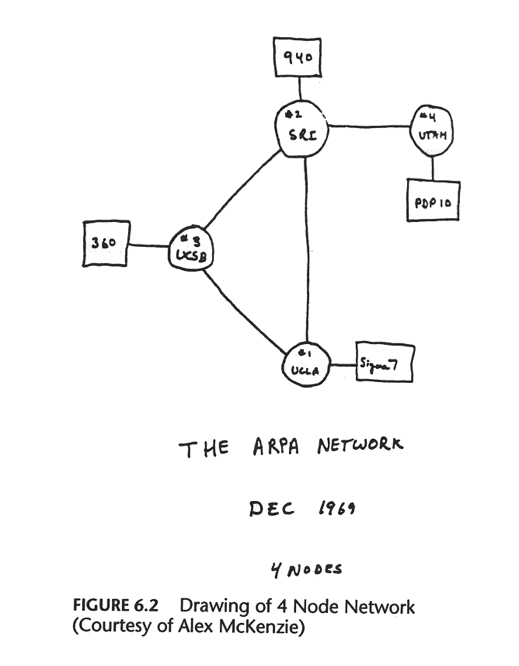
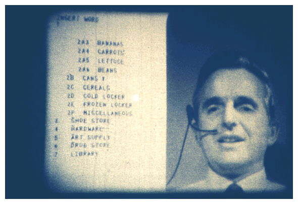
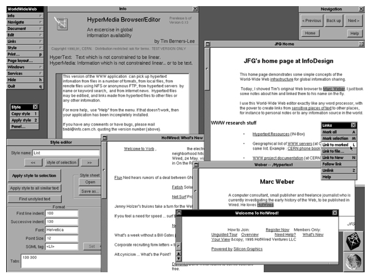

# メディア芸術基礎 I - 第1回: WWW概論

## 今日の内容

### WWWの歴史を駆け足で

* インターネット ≠ WWW
* インターネットの簡単な歴史
* WWWへ至る道

### WWWの仕組み

* ハイパーテキスト
* マークアップ
* WWWを支える3つの仕組み(URI、HTTP、HTML)
	
## WWWの歴史

###「インターネット = WWW」ではない



* WWWは、インターネット上の一機能にしか過ぎない
* WWW以前にもインターネットには長い歴史が存在


### WWW以前のインターネットの機能例

* telnet：遠隔にあるサーバを端末から操作
* ftp：ホスト間のファイル転送
* email：メール
* Usenet：ネットニュース
* archie: ftpファイル検索
* gopher: 情報検索


### 例：archieによるファイル検索

	$ archie -h archie.iij.ad.jp XFree86

	Host ftp.gmd.de
	Location: /mirrors2/suse/discontinued/ppc/7.0/suse/inst-sys/usr/X11R6/bin
		   FILE -r--r--r--	1762856  Nov 17 2000  XFree86
	Location: /mirrors2/suse/ftp.suse.com/suse/i386/supplementary/X
	  DIRECTORY drwxr-xr-x	   4096  Jul 16 2003  XFree86
	Location: /mirrors2/suse/ftp.suse.com/suse/ppc/7.3/suse/inst-sys/usr/X11R6/bin
		   FILE -r--r--r--	1822964  May  3 2002  XFree86
	Location: /mirrors3/ftp.linuxppc.org/contrib/software/System_Environment
	  DIRECTORY drwxr-xr-x	   4096  May 27 2000  XFree86
	Location: /mirrors3/ftp.linuxppc.org/contrib/sources/System
	  DIRECTORY drwxr-xr-x	   4096  Mar 23 2000  XFree86

	Host rtfm.mit.edu
	Location: /pub/usenet-by-group/comp.os.linux.answers/linux/howto
		   FILE -rw-rw-r--	  47032  Nov  6 1995  XFree86
	Location: /pub/usenet-by-hierarchy/comp/os/linux/answers/linux/howto
		   FILE -rw-rw-r--	  47032  Nov  6 1995  XFree86

	Host ftp.sdsc.edu
	Location: /mirrors/cerias.purdue.edu/pub/os/FreeBSD/branches/-current/ports/x11
	  DIRECTORY drwxr-xr-x		512  Oct 13 2000  XFree86
	Location: /mirrors/cerias.purdue.edu/pub/os/FreeBSD/development/FreeBSD-CVS/ports/x11
	  DIRECTORY drwxr-xr-x		512  Oct 13 2000  XFree86
	Location: /mirrors/coast.cs.purdue.edu/pub/os/FreeBSD/branches/-current/ports/x11
	  DIRECTORY drwxr-xr-x		512  Oct  4 2000  XFree86
	Location: /mirrors/coast.cs.purdue.edu/pub/os/FreeBSD/development/FreeBSD-CVS/ports/x11
	  DIRECTORY drwxr-xr-x		512  Oct  4 2000  XFree86

	  

## インターネットの簡単な歴史

* 1957：ARPA創設
* 1962：J.C.R. Licklider、地球規模のコンピュータネットワークのアイデア発表「銀河間コンピュータネットワーク」
* 1969：ARPANET始動
* 1971：初のemailを送受信
* 1979：USENET開始
* 1983：TCP/IPの採用
* 1984：JUNET (Japan University Network)開始
* 1990：ARPANET終了
* 1991：Tim Berners-Lee、WWW発表
* 1993：Mosaic発表 (後のNetscape)
* 1995：Yahoo! 設立
* 1998：Google設立
* 2004：Facebook設立

### 参考: 
* [インターネットの歴史 - Wikipedia](http://ja.wikipedia.org/wiki/%E3%82%A4%E3%83%B3%E3%82%BF%E3%83%BC%E3%83%8D%E3%83%83%E3%83%88%E3%81%AE%E6%AD%B4%E5%8F%B2)
* [日本のインターネット歴史年表 | Impress Innovation Lab.](http://i.impressrd.jp/e/2007/08/23/111)


### 1969年、ARPANET開始当初のネットワーク
UCLA、スタンフォード研究所、UCSD、ユタ大学



### 1971年当時のARPANET


## ハイパーテキスト(Hypertext)

### WWWの成立に寄与した、もうひとつの基盤

* 技術的な基盤: インターネット
* 思想的基盤: ハイパーテキスト (Hypertext)

### ハイパーテキスト(hypertext)

* 複数の文書を相互に関連付け、結び付ける仕組み
* ハイパーリンク：テキスト間を結びつける参照のこと


### 論文 “As We may think (我々が考えるように)” (1945)

* ヴァネバー・ブッシュ (Vannevar Bush)
* 図書館的な情報検索システムは情報の増加に追いつかない
* 連想の網の中で多くの知識を格納する → ハイパーテキスト



### memex (1945)　
* ヴァネバー・ブッシュが"As We May Think" で発表したコンピュータシステムの概念
* 自動的に相互参照をたどって他の作品（本やフイルム）を表示



### Project Xanadu (1960)

* テッド・ネルソン(Theodor Holm Nelson)
* コンピュータネットワーク上にハイパーテキストを実現する計画
* 「ハイパーテキスト」という用語を初めて使用 (1965)
* 後のWWWに多大な影響



### NLSシステム(1968)

* ダグラス・エンゲルバート(Douglas Engelbart)
* ハイパーテキストインタフェース（と初の実用的なGUI）のデモを公衆の前で初めておこなう
* ["The Mother of All Demos"「すべてのデモの母」1968](http://sloan.stanford.edu/mousesite/1968Demo.html)

### アスペン・ムービーマップ (1978)

* マイケル・ネイマーク(michael naimark)
* 初のハイパーメディアアプリケーション
* アスペンの街をバーチャル旅行することができる
* [http://www.naimark.net/projects/aspen.html](http://www.naimark.net/projects/aspen.html)



### HyperCard (1987)　
* Appleのビル・アトキンソン(Bill Atkinson)
* ハイパーテキストを実現した初の商用ソフトウェア
* リンクで結合されたカードの集積をスタックとして扱う
* ネットワークには未対応



#### Hypercard、スタックの例
* Electronic Whole Earth Catalog: Structure to the Universe (1989)


* The Manhole (1987) - ハイパースペース上でのインタラクティブ小説



## WWWの誕生

### ティム・バーナーズ＝リー（Tim Berners-Lee)
* WWWの生みの親



### ティム・バーナーズ＝リーの ”World Wide Web”
* WWW開発の動機
* 欧州原子核研究機構（CERN）で数千人の研究者同士の情報を行きわたらせるためのシステム構築を命じられる
* CERN - スイスのジュネーヴ郊外にある、世界最大規模の素粒子物理学の研究所
* 参考: [TEDカンファレンスでの、ティム・バーナーズ＝リーの講演](http://www.ted.com/talks/tim_berners_lee_on_the_next_web.html)

* Tim Berners-LeeがWorld Wide Webの開発で使用したNeXT cube

## Webブラウザの発展

参考: [The Evolution of Web - Webの進化](http://www.evolutionoftheweb.com/)


	

	


